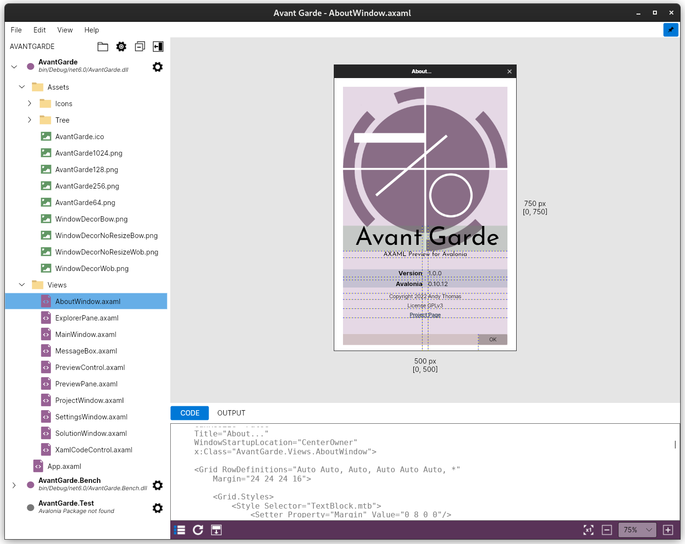
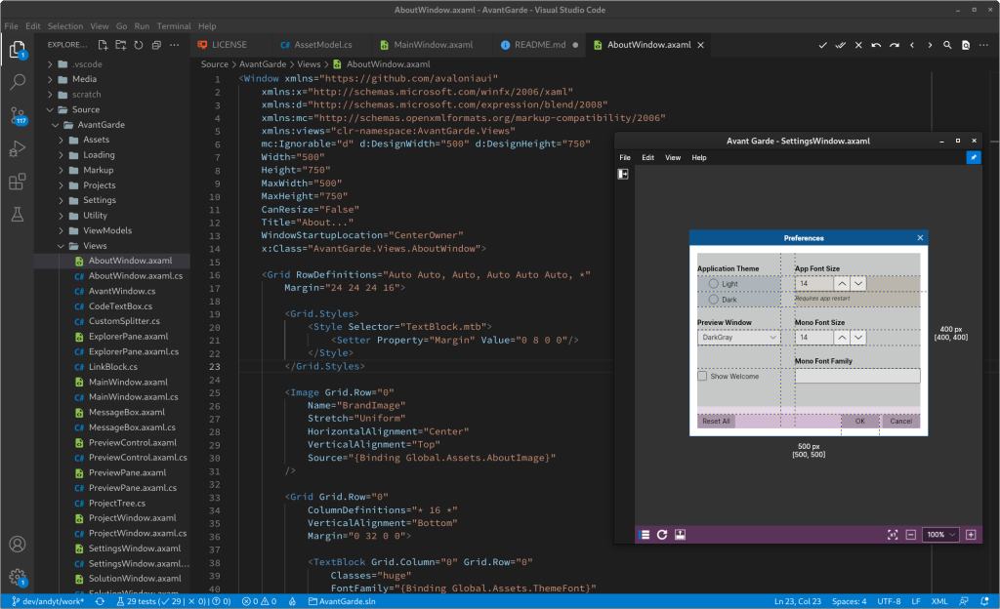
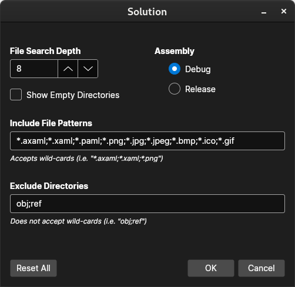

# Avant Garde #
**Avant Garde** is a cross-platform previewer for the C# Avalonia Framework. It was the first Avalonia preview
solution for Linux.

**[DOWNLOAD](https://github.com/kuiperzone/AvantGarde/releases/latest)**

Downloads include AppImages for Linux and Setup files for Windows. Don't forget to set the "Execute" permission
for AppImage files.

Alternatively, clone and build the source. There are no special build requirements.

For further information see the **main project page**:

[https://kuiper.zone/avantgarde-avalonia/](https://kuiper.zone/avantgarde-avalonia/)

**Note.** Avant Garde is licensed under GPLv3 or later.

## Features ##

* Avant Garde is a standalone application rather than an extension for an IDE. This means that is IDE agnostic.

* It provides a read-only view of your Avalonia project, watching for file changes. Previews are updated the
moment you save changes from your IDE.

* While Avant Garde looks like a simple IDE itself and, indeed, can be used to browse your entire project, the
generation of AXAML previews is the primary use case. Currently, it is not a XAML designer or an editor. It does not
modify your project files or write to your project directories.

* It supports preview scale, mouse interaction and a range of other features.

* Command line arguments provide for integration with an IDEs where supported. For example, it is possible to launch
Avant Garde with so that a particular AXAML file is selected and shown on opening. It is also possible to launch it
with its built-in **Project Explorer** closed (to the side) so as to minimize the application window foot-print.

* Avant Garde requires the installation of the **Avalonia Nuget Package** in order to work because it utilizes the
"preview host" which ships with Avalonia. It supports only .NET projects (not .NET Framework), and Avalonia
AXAML forms. It cannot be used to preview WPF XAML.

* It supports both a light and dark theme so as to match your desktop. See the application "Preferences".

## Using Avant Garde ##

Simply open a *.sln or *.csproj as you would in any IDE.

By the default, only "*.axaml;*.xaml" and image files are shown in the Project Explorer as these are the primary
files you will want to see in Avant Garde (the rest of your project will be hidden but see "Solution Settings" below).

Below, Visual Code on Linux with Avant Garde floating in stay-on-top mode to the right. Note, here, that the
Avant Garde project explorer has been closed (to the side) so as to focus on the form while minimizing the window
footprint. The preview will updated as AXAML changes saved to file from the IDE.

**Important.** In order to generate previews, Avant Garde must find your application assembly which must first be
built. Normally, if your assembly is in the usual place, i.e. under "project/bin/Debug...", Avant Garde will find it.
If, however, if you are using variables or a "Directory.Build.props" file to set your output location, you will need
to specify this location at the project level (see below).

### Solution Settings ###
Each solution (or project file) you open in Avant Garde has its own "settings". These are specific to Avant Garde and,
typically, the default values suffice and you will not have to change them. Any changes you do make, however, are cached
by Avant Garde so that changes persist between application launches. Note that they are stored outside of your project
as Avant Garde does not write to your project directories.

With a solution file open, click "Edit -> Solution", or the "cog icon" in the toolbar, to view the solution level
settings.

For example, setting "Include File Pattern" to "*" will cause **all project files** to be shown in the Explorer.
Remember, however, that views are read-only and Avant Garde is not intended to be used as a text editor or IDE.

#### Project Settings ####
Project settings pertain to each project within a solution.

Click "Edit -> Project", or the "cog icon" beside the project in the Explorer.

As described, if your target assembly output cannot be located on disk, this is the place to specify it, as shown above.

Moreover, if your project is a class library, it will be necessary to specify a relavent application project
before previews can be generated.

## Command Line Options ##
Command line options can be utilitized to launch Avant Garde from an IDE, as supported.

**Usage:**

    AvantGarde [filename] [-options]

This assumes `AvantGarde` is in the path.

Typically, filename is expected to be .sln or .csproj file. However, it is also possible to launch AvantGarde with
*any file* within the project hierarchy provided there exists a .csproj file in a parent directory above the file.

**Options:**

    -h, --help
    Show help information.

    -v, --version
    Show version information.

    -m, --min-explorer
    Show with minimized explorer and non-maximized main window.

    -s=name, --select=name
    Select and preview given item on opening. Name can be a leaf name or fully qualified path.

**Examples:**

    AvantGarde ~/MyProject/MyProject.sln --select=MainWindow.axaml

Above, opens a solution with AvantGarde and selects/previews `MainWindow.axaml` on opening.

    AvantGarde ~/MyProject/MyProject.sln -min-explorer -s=MainWindow.axaml

As with the first example, except that the project explorer will be minimized to the side of the window.

    AvantGarde ~/MyProject/Views/MainWindow.axaml

Above, actually does the same as the first example. Here an .axaml file is supplied instead of .sln or .csproj, and
AvantGarde will locate the first .csproj file it finds in the directory structure above the supplied path level.
The `MainWindow.axaml` preview will be shown on opening so that the "--select" option is not necessary here.

## Copyright & License ##

Copyright (C) Andy Thomas, 2022.

Avant Garde Previewer for Avalonia is free software: you can redistribute it and/or modify it under the terms of
the GNU General Public License as published by the Free Software Foundation, either version 3 of the License, or
(at your option) any later version.

Avant Garde is distributed in the hope that it will be useful, but WITHOUT ANY WARRANTY; without even the implied
warranty of MERCHANTABILITY or FITNESS FOR A PARTICULAR PURPOSE. See the GNU General Public License for more details.

### Non-code Assets ###
Images and non-code assets are not subject to GPL.

Avant Garde Project Logo: Copyright (C) Andy Thomas, 2022.
Button and file icons: Copyright (C) Andy Thomas, 2022.
Josefin Sans: Santiago Orozco, SIL Open Font License, Version 1.1.

All other copyright and trademarks are property of respective owners.
